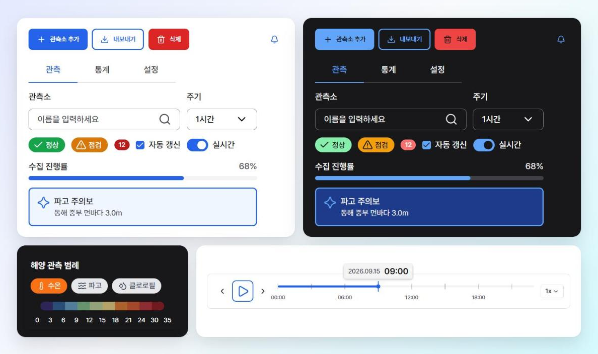

# @koast/ui



[](https://www.npmjs.com/package/@koast/ui)
[](https://koast-crew.github.io/koast-ui/)

한국해양기상기술(KOAST) 디자인 시스템을 그대로 옮긴 **React 컴포넌트 라이브러리**입니다.
Figma 에 정의된 28종을 **설정 없이** 씁니다. Tailwind 설정도, CSS import 도 필요 없습니다.

- **컴포넌트 문서** — [Storybook](https://koast-crew.github.io/koast-ui/)
- **패키지** — [npmjs.com/package/@koast/ui](https://www.npmjs.com/package/@koast/ui)
- **변경 이력** — [CHANGELOG.md](./CHANGELOG.md)

<br>

## 요구 사항

| 패키지 | 버전 | 비고 |
| :-- | :-- | :-- |
| `react` | `^18.0.0 \|\| ^19.0.0` | peerDependency |
| `react-dom` | `^18.0.0 \|\| ^19.0.0` | peerDependency |
| `lucide-react` | `^1.0.0` | **선택.** 아래 [아이콘](#아이콘) 참고 |

번들에 들어가는 런타임 의존성은 **없습니다.** react 계열만 external 이고 나머지는 패키지 안에 완결돼 있습니다.

<br>

## 설치

```bash
npm install @koast/ui
```

```tsx
import { Button, TextField } from '@koast/ui';

export default function App() {
  return (
    <form>
      <TextField label="관측소" placeholder="이름을 입력하세요" />
      <Button color="primary">저장</Button>
    </form>
  );
}
```

**이게 전부입니다.** ESM 진입점이 CSS 를 side-effect 로 import 하므로
Vite · webpack · Parcel · Next.js(App Router 포함) 어디서든 번들러가 알아서 주입합니다.

**단, 번들러 바깥에서는 한 줄이 더 필요합니다.** Node 는 `.css` 를 모르기 때문입니다.

```ts
// vitest.config.ts — 이게 없으면 Unknown file extension ".css" 로 멈춥니다
export default defineConfig({
  test: { server: { deps: { inline: ['@koast/ui'] } } },
});
```

```tsx
// UMD 빌드를 쓸 때만 CSS 를 직접 넣습니다
import '@koast/ui/styles.css';
```

<br>

## Claude Code 스킬

```bash
npx @koast/ui init-skills
```

이 패키지에는 [Claude Code](https://claude.com/claude-code) 용 스킬이 동봉돼 있습니다.
컴포넌트 28종의 props 표 · 예제 · 색 토큰 규칙이 들어 있어, **Claude 가 없는 prop 을 지어내지 않습니다.**

**왜 명령을 따로 실행해야 하나요?** Claude Code 는 `.claude/skills/` 만 탐색하고
`node_modules` 는 들여다보지 않습니다. `npm install` 만으로는 스킬이 패키지 안에 있어도 잡히지 않습니다.
이 명령이 `.claude/skills/koast-ui` → `node_modules/@koast/ui/skills/koast-ui` 심링크를 걸어 줍니다.
심링크라서 `npm update @koast/ui` 하면 스킬 내용도 함께 갱신됩니다.

이미 설치돼 있어도 그냥 다시 실행하면 됩니다. 이 명령이 만든 설치는 심링크든 복사본이든 조용히 덮어씁니다.
직접 만든 `koast-ui` 스킬 폴더가 있으면 멈추고 알려 주며, 그래도 덮어쓰려면 `--force` 를 줍니다.

> 심링크를 만들 수 없는 환경(개발자 모드가 꺼진 Windows 등)에서는 자동으로 복사로 대체됩니다.
> 이때는 라이브러리를 올릴 때마다 명령을 다시 실행하세요.
> 팀 전체에 공유하려면 `.claude/skills/` 를 커밋하면 됩니다.

<br>

## 색은 소비자가 정하지 않습니다

디자인 시스템의 일관성을 **코드 수준에서** 강제합니다. 색을 넣는 통로는 아래 셋뿐입니다.

```tsx
<Button color="danger">삭제</Button>              // ✅ 정해진 intent
<Button color="#ff0000">삭제</Button>             // ❌ 타입 에러
<Button className="bg-red-500">삭제</Button>      // ❌ 토큰 체계 우회
```

**1. intent** — `Button` 이 받는 값은 `primary` · `secondary` · `danger` 셋뿐입니다.
`danger` 는 `variant` 와 무관하게 항상 filled 로 그려집니다(디자인 시스템에 다른 면이 없습니다).
`className` 은 너비 · 여백 · 정렬 같은 **레이아웃 조정에만** 씁니다.

**2. brand 램프 주입** — 시맨틱 토큰은 라이브러리가 고정하지만, brand 램프만은 프로젝트별로 바꿀 수 있습니다.
기본값은 Tailwind blue 입니다.

```ts
import { createBrandThemeCss } from '@koast/ui';

const css = createBrandThemeCss({
  light: { primary: { 50: '#ecfeff', /* … 900 까지 전부 */ } },
  // dark 를 생략하면 light 값을 그대로 씁니다
});
```

50~900 단계를 전부 hex 로 채워야 하고, 형식이 틀리면 예외를 던집니다.
하위 트리에만 적용하려면 `createBrandThemeStyle()` 로 인라인 `style` 을 받으세요.
주입한 램프는 `Button` 의 primary, 포커스 링, `Alert` · `Toast` 의 `status="brand"` 까지 함께 따라갑니다.

**3. 다크 모드** — 기본은 OS 설정(`prefers-color-scheme`)을 따릅니다. 강제하려면 조상 요소에 속성을 겁니다.

```html
<html data-koast-theme="dark">  <!-- 또는 "light" -->
```

<br>

## 컴포넌트

| 분류 | 컴포넌트 |
| :-- | :-- |
| **입력** | `TextField` · `TextArea` · `Select` · `Checkbox` · `Radio` · `Switch` · `Slider` · `ControlGroup` · `Label` |
| **액션** | `Button` · `IconButton` |
| **피드백** | `Alert` · `Toast` · `Modal` · `Tooltip` · `Progressbar` · `Spinner` · `Skeleton` |
| **표시** | `Badge` · `StatusChip` · `Accordion` |
| **내비게이션** | `Tabs` · `Breadcrumbs` · `Pagination` · `Link` · `FolderTree` |
| **도메인** | `TimeLine` · `MapLegend` |

각 컴포넌트의 props 와 예제는 [Storybook](https://koast-crew.github.io/koast-ui/) 에 있습니다.

<br>

## 알아둘 것

- **앱을 침범하지 않습니다.** Tailwind preflight 를 껐고, 포함된 최소 리셋은 전부 `:where()` 로 감싸
  명시도가 0 입니다. 모든 유틸리티에 `koast-` 접두사가 붙어 앱의 Tailwind 와 충돌하지 않습니다.
- **치수는 `html { font-size: 16px }` 기준입니다.** 문서에 적힌 px 값(`Button` md = 48px 등)은 실제로 `rem` 이라
  앱의 루트 글자 크기를 따라 스케일됩니다. 루트가 14px 인 앱에서는 42px 이 됩니다.
  브라우저 글자 크기 확대를 따라가야 접근성이 유지되므로 의도한 동작입니다.
- **`ref` 를 받습니다.** `TextField` · `TextArea` 는 내부 입력 요소로, `Select` 는 트리거 `<button>` 으로
  전달됩니다. `Modal` 의 `initialFocusRef`, 검증 실패 시 `focus()`, react-hook-form 의 `register()` 에 씁니다.
- **`onChange` 는 `(value, event)` 입니다.** 네이티브와 달리 값이 먼저 옵니다.
- **기준 폰트는 Pretendard 입니다.** `font-family` 를 강제하지는 않지만, 아이콘과 라벨의 세로 정렬이
  폰트 메트릭에 좌우됩니다. 14px 기준 편차는 Pretendard · system-ui 0.5px, Noto Sans KR · IBM Plex Sans KR 1.0px 입니다.
- **CSS 는 전부 아니면 전무입니다.** 컴포넌트를 몇 개 쓰든 51KB(gzip 6.9KB)가 통째로 들어갑니다.
  "설정이 필요 없습니다" 의 대가입니다. JS 는 정상적으로 트리셰이킹됩니다.

### 아이콘

컴포넌트 내부 아이콘은 [`lucide-react`](https://lucide.dev/) v1 을 쓰며 **패키지에 번들돼 있습니다.**
`npm install @koast/ui` 만으로 내부 아이콘은 그대로 나옵니다.

`startIcon` · `icon` 같은 prop 에 아이콘을 **직접 넘길 때만** 설치가 필요합니다.

```bash
npm install lucide-react
```

```tsx
import { Trash2 } from 'lucide-react';

<Button color="danger" startIcon={<Trash2 />}>삭제</Button>
```

optional peerDependency 라 설치하지 않아도 경고가 뜨지 않습니다.
다른 아이콘 세트를 써도 되며, 크기는 컴포넌트가 정하므로 굵기만 맞추면 됩니다.

<br>

---

<br>

## 기여

- node >= 20 · npm >= 9 · typescript >= 5

```bash
git clone https://github.com/koast-crew/koast-ui.git
cd koast-ui && npm install

npm run storybook   # 6006 — 컴포넌트 작업은 여기서
npm run dev         # vite dev 서버 (루트는 ./dev playground)
npm run build       # prebuild(tokens) → tsc → vite build
npm run lint        # eslint (포맷 검사 포함)
```

### 색상 토큰

원본은 저장소 루트의 `semantic-color-tokens.csv` **하나**입니다.
Figma 는 대조 대상이고, CSV 단계의 git diff 가 사람이 검토하는 지점입니다.

1. Figma 에서 바뀐 값을 `semantic-color-tokens.csv` 에 반영합니다.
2. `npm run tokens` 를 실행합니다. (`npm run build` 시 자동 실행됩니다.)
3. `tokens.generated.css` · `tailwind.generated.js` · `tokens.generated.ts` 가 다시 생성됩니다.
   **직접 수정하지 마세요.**

컴포넌트에서는 역할별 시맨틱 클래스만 씁니다(`koast-text-interactive-primary`, `koast-bg-danger-subtle` 등).
역할별로 스케일이 분리돼 있어 배경 토큰을 텍스트 색으로 쓰는 오용이 타입 · 클래스 수준에서 막힙니다.

### 스킬 레퍼런스

props 나 JSDoc 을 고쳤다면 다시 생성하세요. 손으로 고치지 마세요.

```bash
npm run skill-docs   # src/components/*/*.types.ts → skills/koast-ui/references/
```

### 배포

`main` 에 push 되면 CI(`.github/workflows/main.yml`)가 Storybook 을 GitHub Pages 로 배포하고,
커밋 메시지에 `Merge pull request` 가 포함되면 patch bump → 태그 → Release → `npm publish` 까지 진행합니다.

> **`main` 에 직접 push 하면 배포가 일어납니다.** PR 을 거쳐 주세요.
> `publish` 권한이 필요하면 `judahwon` 에게 요청하세요.
